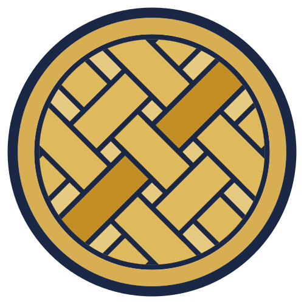

# The Fiscus Brand

  

## The story

In ancient Rome, a *fiscus* was not an institution. It was an object: a **woven rush basket**
used to carry money. The emperor's basket grew into the imperial treasury, the treasury's name
outlived the empire, and two thousand years later its descendants are how half of Europe refers
to the tax authority — *le fisc* in France, *el fisco* in Spain, *il fisco* in Italy,
*der Fiskus* in Germany, *de fiscus* in the Netherlands. The very word **"fiscal"** — as in
*fiscalization*, the thing this project does — is the basket's great-grandchild.

So when this project needed a mark, the answer was already inside the name. You are looking at
**the basket, pressed into a seal**.

### The weave

The interior of the mark is a basket weave — bands of gold interlacing at 45°, each strand
passing over one and under the next. It is the literal *fiscus*, but it earns its place twice
over: a weave is also how this software is built. Independent strands — one per country, one
per tax authority, one per protocol — interlocked into a single fabric that is stronger than
any strand alone. Pull one thread and the weave holds.

One thread is different. A single **amber band** runs through the center of the weave, darker
than the rest: the transaction currently in flight — the one invoice, of millions, that is
right now being carried through the fabric to the tax authority and stamped on its way out.
Every receipt takes its turn as the golden thread.

### The seal

The weave is enclosed in a double ring of navy and gold — the form of an **official seal or
stamp**. That is the other half of what fiscalization *is*: every receipt in Croatia carries
its JIR, every Slovenian invoice its EOR, every Spanish one its QR — a state-issued mark of
authenticity, the modern descendant of wax and *Stempelmarken*. Fiscus applies that stamp on
your behalf. A seal made from a basket: the treasury and the proof of payment in one figure.

## Palette

| Role | Hex | Meaning |
|---|---|---|
| Navy (ink) | `#1a2846` | Authority, ledger ink, the outline of every strand |
| Gold (weave) | `#deb95d` | The treasury — the basket itself |
| Gold (ring) | `#d7ae52` | The seal band |
| Pale gold (field) | `#e7ca81` | The inner field behind the weave |
| Amber (accent) | `#c38f24` | **The golden thread** — the transaction in flight |

Navy on light backgrounds, gold on dark — the lockups and banners ship in both variants.

## Typography

The **FISCUS** wordmark is custom geometric letterforms — uniform stroke weight, rounded
terminals, drawn as SVG paths (no font dependency, no licensing question, renders identically
everywhere). It is part of the lockup; do not retype it in a substitute font. For body text in
docs and materials, pair with a neutral sans (Inter or IBM Plex Sans).

## Assets & where each one goes

| File | Use |
|---|---|
| `logo/fiscus-mark.svg` | **Master mark.** Source of truth — everything derives from this |
| `logo/fiscus-avatar-500-transparent.png` | GitHub organization avatar (transparent background; renders as a circle — the seal is built for it) |
| `logo/fiscus-mark-144.png` | Email signature image — displayed at 72px (2× for retina), hotlinked by the signature template |
| `logo/favicon.svg` / `favicon.ico` / `favicon-16/32.png` | Docs site favicons |
| `lockup/fiscus-lockup-light.svg` / `-dark.svg` (+ `-3x.png`) | Docs navbar, README header — pick per background via `<picture>` + `prefers-color-scheme` |
| `banner/fiscus-readme-1280x320-light/-dark.*` | README hero banner (light/dark pair) |
| `banner/fiscus-readme-tagline-1280x320-light/-dark.*` | README hero banner with the tagline *"Free and open-source fiscalization"* (light/dark pair) |
| `banner/fiscus-social-1280x640.png` | GitHub repo **social preview** (Settings → Social preview) and og:image |
| `banner/fiscus-social-tagline-1280x640.png` | Social preview / og:image with the tagline |
| `monochrome-mark/fiscus-mark-mono.svg` | Single-color contexts: terminal banners, stickers, badges, engraving |
| `email-signature/fiscus-email-signature.html` | Email signature template — paste into your mail client's signature editor as HTML, then replace the name, role, and address |
| `email-signature/fiscus-email-signature.md` | Markdown rendition of the signature for forum profiles, GitHub Discussions, and other Markdown contexts |

## Usage rules

- **One mark.** The seal is the only logo. No alternate marks, no per-module logos.
- **Don't** recolor the weave, rotate the seal, add text inside it, stretch it, or place the
  full-color mark on backgrounds that fight the palette — switch to the monochrome mark instead.
- **Clear space:** keep at least half the seal's radius empty on all sides.
- **Small sizes:** below ~24px use the favicon derivatives (simplified for legibility), never a
  scaled-down full mark.
- The wordmark never appears without the mark in official surfaces; the mark may appear alone.
- Keep the favicon **stable** — people find their tabs by it.
- For who may use these assets and how, see [TRADEMARK.md](TRADEMARK.md) — the marks are
  **not** covered by any open-source code license.

## AI Policy

The assets and documents in this repository were produced with AI assistance. All design decisions were made by the project maintainers, every artifact was human-reviewed, and the maintainers remain accountable for the accuracy and originality of the work.
